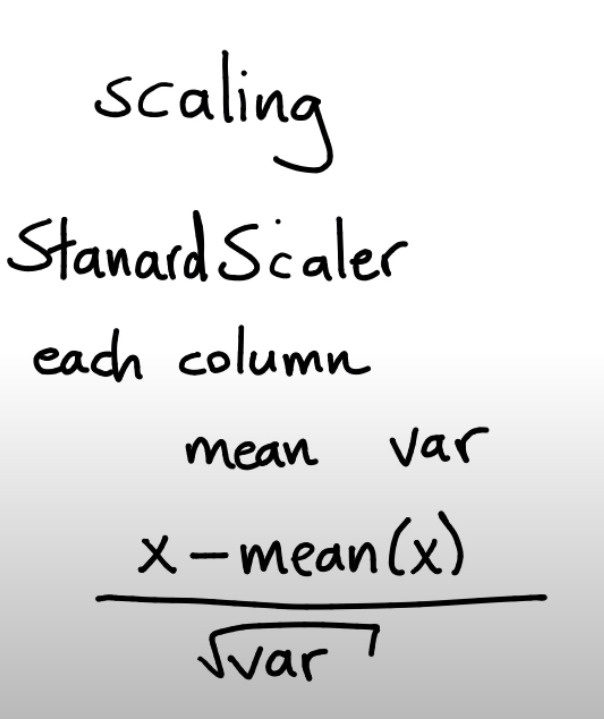

# 2-Preprocessing

1. [Importar librerías y cargar los datos ](#schema1)

# 1. Importar librerías y cargar los datos

~~~python
import numpy as np
import pandas as pd
import matplotlib.pylab as plt
df = pd.read_csv("./data/drawndata1.csv")
~~~

# 2. Separamos los datos

~~~python
X = df[['x', 'y']].values
y = df['z'] == "a"

plt.scatter(X[:, 0], X[:, 1], c=y)
plt.savefig("./images/X_y.png")
~~~

Hay una gran diferencia de escalas entre el eje x e Y, por eso usamos la desviación estandar.

# 3. StandardScaler

~~~python
from sklearn.preprocessing import StandardScaler
X_new = StandardScaler().fit_transform(X)
plt.scatter(X_new[:, 0], X_new[:, 1], c=y)
plt.savefig("./images/X_new_y.png")
~~~

# 4. QuantileTransformer
Transformación por quantiles

~~~python
from sklearn.preprocessing import  QuantileTransformer
X_new = QuantileTransformer(n_quantiles=100).fit_transform(X)
plt.scatter(X_new[:, 0], X_new[:, 1], c=y);
plt.savefig("./images/new_x_q.png")
~~~
