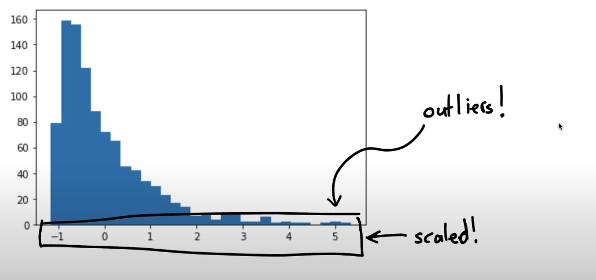

# 2-Preprocessing

1. [Importar librerías y cargar los datos ](#schema1)
2. [Separamos los datos](#schema2)
3. [StandardScaler](#schema3)
4. [QuantileTransformer](#schema4)
5. [Visualización](#schema5)
6. [Cargamos los datos drawndata2](#schema6)
7. [One Hot Encoding](#schema7)

# 1. Importar librerías y cargar los datos

~~~python
import numpy as np
import pandas as pd
import matplotlib.pylab as plt
from sklearn.pipeline import Pipeline 
from sklearn.neighbors import KNeighborsClassifier
df = pd.read_csv("./data/drawndata1.csv")
~~~

# 2. Separamos los datos

~~~python
X = df[['x', 'y']].values
y = df['z'] == "a"

plt.scatter(X[:, 0], X[:, 1], c=y)
plt.savefig("./images/X_y.png")
~~~

Hay una gran diferencia de escalas entre el eje x e Y, por eso usamos la desviación estandar.

# 3. StandardScaler

~~~python
from sklearn.preprocessing import StandardScaler
X_new = StandardScaler().fit_transform(X)
plt.scatter(X_new[:, 0], X_new[:, 1], c=y)
plt.savefig("./images/X_new_y.png")
~~~

# 4. QuantileTransformer
Transformación por quantiles

~~~python
from sklearn.preprocessing import  QuantileTransformer
X_new = QuantileTransformer(n_quantiles=100).fit_transform(X)
plt.scatter(X_new[:, 0], X_new[:, 1], c=y);
plt.savefig("./images/new_x_q.png")
~~~

# 5. Visualización

~~~python
def plot_output(scaler):
    pipe = Pipeline([
        ("scale", scaler),
        ("model", KNeighborsClassifier(n_neighbors=20, weights='distance'))
    ])

    pred = pipe.fit(X, y).predict(X)

    plt.figure(figsize=(9, 3))
    plt.subplot(131)
    plt.scatter(X[:, 0], X[:, 1], c=y)
    plt.title("Original Data")
    plt.subplot(132)
    X_tfm = scaler.transform(X)
    plt.scatter(X_tfm[:, 0], X_tfm[:, 1], c=y)
    plt.title("Transformed Data")
    plt.subplot(133)
    X_new = np.concatenate([
        np.random.uniform(0, X[:, 0].max(), (5000, 1)), 
        np.random.uniform(0, X[:, 1].max(), (5000, 1))
    ], axis=1)
    y_proba = pipe.predict_proba(X_new)
    plt.scatter(X_new[:, 0], X_new[:, 1], c=y_proba[:, 1], alpha=0.7)
    plt.title("Predicted Data")

plot_output(scaler=StandardScaler())
plt.savefig("./images/std.png")
~~~

~~~python
plot_output(scaler=QuantileTransformer(n_quantiles=100))
plt.savefig("./images/quantiles.png")
~~~

# 6. Cargamos los datos drawndata2

~~~python
df = pd.read_csv("./data/drawndata2.csv")
X = df[['x', 'y']].values
y = df['z'] == 'a'
plt.scatter(X[:, 0], X[:, 1], c=y);
plt.savefig("./images/df.png")
~~~

~~~python
from sklearn.linear_model import LogisticRegression
from sklearn.preprocessing import PolynomialFeatures
from sklearn.pipeline import Pipeline
​
pipe = Pipeline([
    ("scale", PolynomialFeatures()),
    ("model", LogisticRegression())
])
​
pred = pipe.fit(X, y).predict(X)
plt.scatter(X[:, 0], X[:, 1], c=pred);
plt.savefig("./images/pred.png")
~~~

# 7. One Hot Encoding

~~~python
from sklearn.preprocessing import OneHotEncoder
arr = np.array(["low", "low", "high", "medium"]).reshape(-1, 1)
enc = OneHotEncoder(sparse=False, handle_unknown='ignore')
enc.fit_transform(arr)
array([[0., 1., 0.],
       [0., 1., 0.],
       [1., 0., 0.],
       [0., 0., 1.]])

enc.transform([["zero"]])
array([[0., 0., 0.]])
~~~